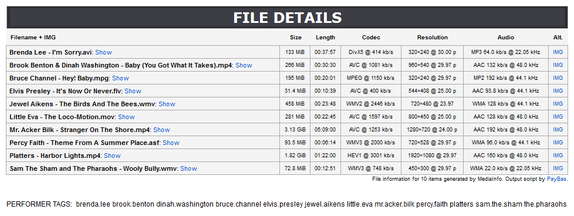
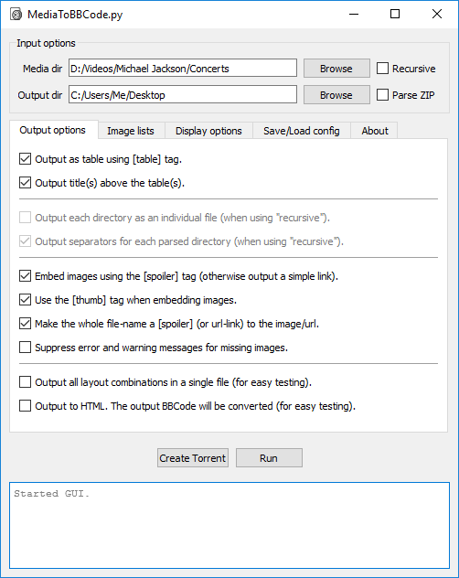

MediaToBBCode.py
==========

A Python script that combines the metadata output of [MediaInfo](http://mediaarea.net/en/MediaInfo) with the BBCode output of various image-hosts to automatically generate a BBCode-formatted presentation of a media-clips collection.



Besides the aesthetics, there's value in having file metadata in your online posts/presentations. Image-hosts will not be online forever. This way, users can find and compare files longer into the future.

This script can save you quite a lot of time by automating the most tedious part of the output. It will also check to make sure that all your images are correctly paired with the file on each line.

It comes with a simple GUI.



## Features
- Easy GUI for those not wanting to use the command-line.
    - Output formatting options (including display/styling options)
    - Manual or automatic image-list selection.
    - Save/load of configurations for easier reuse.
    - Built-in torrent creator (courtesy of [dottorrent-gui](https://github.com/kz26/dottorrent-gui)).
- Parse local media files (recursively or not) using the MediaInfo lib.
- Cleanup of media metadata.
- Detect image-set ZIP archives and provide information on their contents.
- Automated image matching with popular image-host BBCode output, as well as backup images.
- Output as BBCode for easy online use.
- Multiple layout options.
- Automatically generate performer tags (as found in the file-names).

#### Requirements
These requirements only apply if you're using the python script. The executable files have all these packed.
- [Python 3.4+](https://www.python.org/downloads/)
- [MediaInfo](https://mediaarea.net/en/MediaInfo/Download) (32/64bit dll/lib must match Python environment)
- [pymediainfo](https://pypi.python.org/pypi/pymediainfo)
- [PyQt5](https://riverbankcomputing.com/software/pyqt/intro) (if you wish to use the GUI)
- [dottorrent-gui](https://github.com/kz26/dottorrent-gui) (if you wish to use the GUI)
- [Pillow](https://python-pillow.org/) (if you wish to process image-sets)
- [bbcode](https://pypi.python.org/pypi/bbcode/1.0.19) (if you wish to output as HTML)

For Ubuntu this would be something like:
````
sudo apt install mediainfo    # MediaInfo library
sudo apt install python3-pip  # python package manager
pip3 install pymediainfo      # python interface for MediaInfo
pip3 install PyQt5            # if you wish to use the GUI
pip3 install dottorrent-gui   # if you wish to use the GUI
pip3 install pillow           # if you wish to process image-sets
pip3 install bbcode           # if you wish to output as HTML
````

## Instructions

1. Make sure you have all the required elements listed above (or use the executable GUI in `/dist`).
1. Use your favorite thumbnail maker application to create screenshots of all the videos. Make sure that the output images have the exact same file-name as the original videos (besides the extension obviously). But __don't__ include the original media extension in the output name. So `foo.mp4` should give `foo.jpg`, __not__ `foo.mp4.jpg`.
1. Upload all the (thumbnail) images to one of the following image-hosts: *
    * [ImageBam.com](http://www.imagebam.com/)
    * [Postimage.io](https://postimage.io/)
    * [PiXhost.org](http://pixhost.org/)
    * [ImageTwist](http://imagetwist.com/)
    * [ImageVenue.com](http://imagevenue.com/)
    * [imgChili.net](http://imgchili.net/)
    * Adult content permitted (as requested):
        * [PIXXXELS.org](http://pixxxels.org/)
        * [Jerking](https://jerking.empornium.ph/)
        * [Fapping](https://fapping.empornium.sx/)
1. Copy the Forum/BBCode output text as displayed on the host website after uploading, and paste it into a new txt file. Lets call it `my-clips.txt` for now. **
1. Rename the txt-file(s) you just created containing the image-host data, to the directory name you want to parse. So if you want to parse `/home/me/Vids/Led Zeppelin`, name the file `Led Zeppelin.txt` (and `Led Zeppelin_alt.txt` if you want to add a backup host).
1. Place the txt-file(s) in the directory where you want your output files to be created (like `~/Desktop/output/`).
1. Run: `python3 cli.py -m "/home/me/Vids/Led Zeppelin" -o ~/Desktop/output/`
    * __Or use the executable GUI.__ You can find it in `/dist`
1. Copy the contents of the generated file (`Led Zeppelin_output.txt` in this case) into your presentation.

\* _These image-hosts are supported because they all share one important similarity: the file-names for the uploaded images are predictable and the slugs are reproducable offline. Without that, we wouldn't be able to match our output to the correct online images._

\** _If you want to add an additional image-host as a backup in case the primary host goes down, simply add an extra txt containing the secondary host's output in a file with the `_alt` suffix (`my-clips_alt.txt` in this example).
You can also add a higher-resolution image-list which will be displayed outside the table (thus being less constrained), by adding a file with the `_fullsize` suffix (`my-clips_fullsize.txt` in this example) and using the `-z` command-line option._

#### Command-line example
Files (using absolute paths in this example, but relative paths work equally well):
````
/mnt/
|-- foo/
    |-- bar/
    |   |-- Michael Jackson - Live 95.mp4
    |   |-- Michael Jackson BTS.mov
    |-- Michael Jackson - Thriller.flv
    |-- Michael Jackson - Bad.mkv
    |-- Michael Jackson on Tour.wmv

~/Desktop/post one/foo.txt      (BBCode output from image-host: 3 entries)
~/Desktop/post all/foo.txt      (BBCode output from image-host: 5 entries)
~/Desktop/post all/foo_alt.txt  (BBCode output from back-up image-host: 5 entries)
````
Run: `python3 cli.py -m /mnt/foo -o "~/Desktop/post one"`

Run: `python3 cli.py -m /mnt/foo -o -r "~/Desktop/post all"` (recursive)

Output:
````
~/Desktop/post one/foo_output.txt   (fully formatted BBCode with 3 entries)
~/Desktop/post all/foo_output.txt   (fully formatted BBCode with 5 entries with alt)
````

## Command-line options and arguments
##### Input options
* `-m <path>` or `--mediadir <path>` The directory to use when looking for video files to process.
* `-o <path>` or `--outputdir <path>` The output directory, where image-lists should be located, and `_output.txt` files are written. If `-o` isn't specified, the media-dir (`-m`) will act as output dir.
* `-r` or `--recursive` Will enable recursive searching for media files. Meaning it will include all sub-directories of `-m`.
* `-z` or `--zip` Will process all encountered ZIP archives as image-sets and provide information about their contents (number of images, image resolution, size, etc.)

##### Output options
* `-l` or `--list` Generates a simpler (and uglier) list instead of a table. Use this if the BBCode engine on your website doesn't support `[table]` tags.
* `-i` or `--individual` Generates a separate output file for each directory successfully traversed recursively (and named accordingly).
    * applies if: `--recursive`
* `-f` or `--flat` Prevents the creation of separators (with the dir name) when switching directories in recursive mode.
    * applies if: `--recursive` and not `--individual`
* `-b` or `--bare` Stops the table title heading from being automatically generated. Use this if the BBCode engine on your website doesn't support `[table]` tags or if you simply don't like it.
* `-u` or `--url` Embeds a simple link to the full-sized image in the output, rather than a thumbnail (which links to the same image). Use this if the BBCode engine on your website doesn't support `[spoiler]` tags.
* `-t` or `--tinylink` Instead of the whole file-name being a link to the full-sized image (or a `[spoiler]` tag), a smaller link to the same image will be inserted in the row instead.
* `-n` or `--nothumb` Will force embedded images to be output using the `[img]` tag. Use this if the BBCode engine on your website doesn't support `[thumb]` tags.
* `-s` or `--suppress` Prevents warning messages from appearing in the output if no suitable image or image-link was found.
* `-q` or `--fullsize` Will output all image-links located in the `_fullsize.txt` file in-line above the main content in a single `[spoiler]` tag.
* `-a` or `--all` Will output all 7 different layout options below each other, easy for testing and picking your favorite. Note that this will include layouts with `[table]` and `[spoiler]` tags, so be careful if these aren't supported.
* `-w` or `--webhtml` Will convert the final BBCode output to HTML and open your browser automatically to view the output.

##### Other
* `-c` or `--config <file>` Load settings from a previously saved config file.
* `-x` or `--xdebug` For debugging image-host output slugs. Only for developers.

### Support

If you're having problems with the script, pay close attention to the messages in the console. There will be very little (if any) support from me.

### Disclaimer

I've only tested this with Python 3.4, 3.5 and 3.6, both on Windows 10 and Ubuntu. I've tried various media files, but there are quite a lot of video/audio codecs out there in the world, and whether MediaInfo can process them correctly is not a sure thing. A few manual fixes to correct the metadata have been added, but there's bound to be some codecs/formats that slipped by. In short: your mileage may vary. Use at your own risk.

### License
[GNU General Public License v3](http://opensource.org/licenses/GPL-3.0)

© 2017 - PayBas
